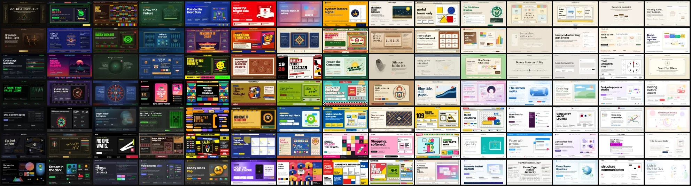

<!--
  Reading the raw file? Then this drawer was left open for you.
  Everything in /designs is plain markdown. Fork it, remix it, ship it.
-->

<p align="center">
  
</p>

<h1 align="center">You found the unlocked drawer.</h1>

<p align="center">
  On <a href="https://designbycurio.com">designbycurio.com</a>, every Curio style takes a credit to unlock.<br/>
  These 105 are free here, for good. Consider it a thank-you for finding us on GitHub.
</p>

<p align="center">
  <a href="#install"><b>Install</b></a> ·
  <a href="#open-the-drawers"><b>See all 105</b></a> ·
  <a href="designs/INDEX.md">Index</a> ·
  <a href="README.zh-CN.md">中文</a>
</p>

---

**Curio** is a design style library for AI. Each style — a movement like Bauhaus, a brand like Stripe, a tradition like Hokusai's woodblock prints — is written up as a `DESIGN.md` your AI can read and apply: colors, type, spacing, components, and the rules that make it feel right.

**This skill** puts 105 of them in your agent, with one guide (`SKILL.md`) that teaches it to use them well. You say what to make: a deck, a landing page, a poster, a report, an email. The style decides how it looks.

## Install

**Claude Code, Codex, Cursor, OpenCode and 75+ other agents**

```bash
npx skills add designbycurio/curio-design-skill -g
```

**Claude Code, by hand**

```bash
git clone --depth 1 https://github.com/designbycurio/curio-design-skill.git ~/.claude/skills/curio
```

**No install at all:** open any style in [`designs/`](designs/INDEX.md), copy the file into ChatGPT, Claude or any chat, and tell it what to make.

Then ask for something. Naming Curio or a style is enough to wake the skill:

> Use Curio Bauhaus to make a 10-slide pitch deck for my climate startup.
>
> Make our launch email in the Stripe 2024 style.
>
> A Hokusai-style poster for my design talk, please.

Your agent reads the style and `SKILL.md`, then builds what you asked for as a single HTML file.

## A few to start with

<table>
<tr>
<td align="center" width="20%"><a href="designs/bauhaus-weimar.md"><br/><sub><b>Bauhaus Weimar</b></sub></a></td>
<td align="center" width="20%"><a href="designs/stripe-2024.md"><br/><sub><b>Stripe 2024</b></sub></a></td>
<td align="center" width="20%"><a href="designs/edo-ukiyo-e-hokusai.md"><br/><sub><b>Edo Ukiyo-e (Hokusai)</b></sub></a></td>
<td align="center" width="20%"><a href="designs/memphis-sottsass-1981.md"><br/><sub><b>Memphis (Sottsass 1981)</b></sub></a></td>
<td align="center" width="20%"><a href="designs/muji-japan.md"><br/><sub><b>MUJI</b></sub></a></td>
</tr>
<tr>
<td align="center" width="20%"><a href="designs/the-matrix-green-code-1999.md"><br/><sub><b>The Matrix (Green-Code)</b></sub></a></td>
<td align="center" width="20%"><a href="designs/art-deco-jazz-age.md"><br/><sub><b>Art Deco Jazz Age</b></sub></a></td>
<td align="center" width="20%"><a href="designs/linear-2024.md"><br/><sub><b>Linear 2024</b></sub></a></td>
<td align="center" width="20%"><a href="designs/studio-ghibli-miyazaki.md"><br/><sub><b>Studio Ghibli (Miyazaki)</b></sub></a></td>
<td align="center" width="20%"><a href="designs/vaporwave-tumblr-2012.md"><br/><sub><b>Vaporwave (Tumblr 2012)</b></sub></a></td>
</tr>
</table>

## Open the drawers

All 105, in four drawers. Click a style to read its `DESIGN.md`.

<details>
<summary><b>Brands & products</b> · 43</summary>
<br/>

<table>
<tr>
<td align="center" width="20%"><a href="designs/aesop-bottles.md"><br/><sub><b>Aesop</b></sub></a></td>
<td align="center" width="20%"><a href="designs/airbnb-2014.md"><br/><sub><b>Airbnb 2014</b></sub></a></td>
<td align="center" width="20%"><a href="designs/apple-fitness-rings-closed-2024.md"><br/><sub><b>Apple Fitness Rings Closed (2024)</b></sub></a></td>
<td align="center" width="20%"><a href="designs/apple-liquid-glass-2024.md"><br/><sub><b>Apple Liquid Glass 2024</b></sub></a></td>
<td align="center" width="20%"><a href="designs/caterpillar-construction-yellow-1925.md"><br/><sub><b>Caterpillar Construction Yellow (1925)</b></sub></a></td>
</tr>
<tr>
<td align="center" width="20%"><a href="designs/coca-cola-classic.md"><br/><sub><b>Coca-Cola Classic</b></sub></a></td>
<td align="center" width="20%"><a href="designs/danish-ph5-louis-poulsen-1958.md"><br/><sub><b>Danish PH5 Louis Poulsen (1958)</b></sub></a></td>
<td align="center" width="20%"><a href="designs/dieter-rams-braun.md"><br/><sub><b>Dieter Rams / Braun</b></sub></a></td>
<td align="center" width="20%"><a href="designs/discord-2024.md"><br/><sub><b>Discord 2024</b></sub></a></td>
<td align="center" width="20%"><a href="designs/duolingo-2024.md"><br/><sub><b>Duolingo 2024</b></sub></a></td>
</tr>
<tr>
<td align="center" width="20%"><a href="designs/emoji-design-blob-noto-2013.md"><br/><sub><b>Emoji &amp; Sticker Design</b></sub></a></td>
<td align="center" width="20%"><a href="designs/etsy-handmade.md"><br/><sub><b>Etsy Handmade</b></sub></a></td>
<td align="center" width="20%"><a href="designs/figma-2024.md"><br/><sub><b>Figma 2024</b></sub></a></td>
<td align="center" width="20%"><a href="designs/finnish-marimekko-unikko-1964.md"><br/><sub><b>Finnish Marimekko Unikko (1964)</b></sub></a></td>
<td align="center" width="20%"><a href="designs/flat-design-ios7.md"><br/><sub><b>Flat Design iOS 7</b></sub></a></td>
</tr>
<tr>
<td align="center" width="20%"><a href="designs/github-dark.md"><br/><sub><b>GitHub Dark</b></sub></a></td>
<td align="center" width="20%"><a href="designs/google-material-3.md"><br/><sub><b>Google Material 3 Expressive</b></sub></a></td>
<td align="center" width="20%"><a href="designs/ikea-blue-yellow.md"><br/><sub><b>IKEA</b></sub></a></td>
<td align="center" width="20%"><a href="designs/klarna-shopping.md"><br/><sub><b>Klarna</b></sub></a></td>
<td align="center" width="20%"><a href="designs/lego-classic.md"><br/><sub><b>LEGO Classic</b></sub></a></td>
</tr>
<tr>
<td align="center" width="20%"><a href="designs/linear-2024.md"><br/><sub><b>Linear 2024</b></sub></a></td>
<td align="center" width="20%"><a href="designs/lufthansa-aicher-crane-1962.md"><br/><sub><b>Lufthansa (Aicher)</b></sub></a></td>
<td align="center" width="20%"><a href="designs/material-1-google.md"><br/><sub><b>Material Design 1.0</b></sub></a></td>
<td align="center" width="20%"><a href="designs/mercadolibre-yellow-2015.md"><br/><sub><b>Mercado Libre Yellow</b></sub></a></td>
<td align="center" width="20%"><a href="designs/midjourney-art.md"><br/><sub><b>Midjourney</b></sub></a></td>
</tr>
<tr>
<td align="center" width="20%"><a href="designs/miro-collab-yellow.md"><br/><sub><b>Miro Collab Yellow</b></sub></a></td>
<td align="center" width="20%"><a href="designs/muji-japan.md"><br/><sub><b>MUJI</b></sub></a></td>
<td align="center" width="20%"><a href="designs/national-geographic.md"><br/><sub><b>National Geographic</b></sub></a></td>
<td align="center" width="20%"><a href="designs/nike-just-do-it-1988.md"><br/><sub><b>Nike &quot;Just Do It&quot; (1988)</b></sub></a></td>
<td align="center" width="20%"><a href="designs/nintendo-game-boy.md"><br/><sub><b>Nintendo Game Boy</b></sub></a></td>
</tr>
<tr>
<td align="center" width="20%"><a href="designs/notion-modern.md"><br/><sub><b>Notion Modern</b></sub></a></td>
<td align="center" width="20%"><a href="designs/polaroid-instant.md"><br/><sub><b>Polaroid Instant</b></sub></a></td>
<td align="center" width="20%"><a href="designs/slack-2019.md"><br/><sub><b>Slack 2019</b></sub></a></td>
<td align="center" width="20%"><a href="designs/spotify-dark.md"><br/><sub><b>Spotify Dark</b></sub></a></td>
<td align="center" width="20%"><a href="designs/spotify-rainbow-wrap-2023.md"><br/><sub><b>Spotify Wrapped 2023</b></sub></a></td>
</tr>
<tr>
<td align="center" width="20%"><a href="designs/starbucks-1971-siren.md"><br/><sub><b>Starbucks (Siren)</b></sub></a></td>
<td align="center" width="20%"><a href="designs/stripe-2024.md"><br/><sub><b>Stripe 2024</b></sub></a></td>
<td align="center" width="20%"><a href="designs/substack-2023.md"><br/><sub><b>Substack 2023</b></sub></a></td>
<td align="center" width="20%"><a href="designs/swiss-rail-sbb-clock-1944.md"><br/><sub><b>Swiss Railway Clock</b></sub></a></td>
<td align="center" width="20%"><a href="designs/terminal-vim-dracula-2014.md"><br/><sub><b>Terminal Vim Dracula (2014)</b></sub></a></td>
</tr>
<tr>
<td align="center" width="20%"><a href="designs/tiffany-blue.md"><br/><sub><b>Tiffany &amp; Co</b></sub></a></td>
<td align="center" width="20%"><a href="designs/london-underground-beck-1933.md"><br/><sub><b>Tube Map (Beck)</b></sub></a></td>
<td align="center" width="20%"><a href="designs/y2k-aqua-2000.md"><br/><sub><b>Y2K Aqua 2000</b></sub></a></td>
</tr>
</table>

</details>

<details>
<summary><b>Art & design movements</b> · 23</summary>
<br/>

<table>
<tr>
<td align="center" width="20%"><a href="designs/art-brut-dubuffet-1948.md"><br/><sub><b>Art Brut (Dubuffet, 1948)</b></sub></a></td>
<td align="center" width="20%"><a href="designs/art-deco-jazz-age.md"><br/><sub><b>Art Deco Jazz Age</b></sub></a></td>
<td align="center" width="20%"><a href="designs/art-nouveau-mucha.md"><br/><sub><b>Art Nouveau (Mucha)</b></sub></a></td>
<td align="center" width="20%"><a href="designs/bauhaus-weimar.md"><br/><sub><b>Bauhaus Weimar</b></sub></a></td>
<td align="center" width="20%"><a href="designs/bollywood-poster-1970s.md"><br/><sub><b>Bollywood Poster Art (1970s)</b></sub></a></td>
</tr>
<tr>
<td align="center" width="20%"><a href="designs/brutalist-web-2014.md"><br/><sub><b>Brutalist Web 2014</b></sub></a></td>
<td align="center" width="20%"><a href="designs/de-stijl-mondrian.md"><br/><sub><b>De Stijl</b></sub></a></td>
<td align="center" width="20%"><a href="designs/edo-ukiyo-e-hokusai.md"><br/><sub><b>Edo Ukiyo-e (Hokusai)</b></sub></a></td>
<td align="center" width="20%"><a href="designs/frutiger-aero-2007.md"><br/><sub><b>Frutiger Aero 2007</b></sub></a></td>
<td align="center" width="20%"><a href="designs/futura-typeface-renner-1927.md"><br/><sub><b>Futura Typeface (Renner, 1927)</b></sub></a></td>
</tr>
<tr>
<td align="center" width="20%"><a href="designs/glassmorphism-frosted-2020.md"><br/><sub><b>Glassmorphism</b></sub></a></td>
<td align="center" width="20%"><a href="designs/gould-hummingbird-plate-1861.md"><br/><sub><b>Gould Hummingbird Plate</b></sub></a></td>
<td align="center" width="20%"><a href="designs/memphis-sottsass-1981.md"><br/><sub><b>Memphis (Sottsass 1981)</b></sub></a></td>
<td align="center" width="20%"><a href="designs/polish-poster-school-1960s.md"><br/><sub><b>Polish Poster School (1960s)</b></sub></a></td>
<td align="center" width="20%"><a href="designs/constructivism-russian.md"><br/><sub><b>Russian Constructivism</b></sub></a></td>
</tr>
<tr>
<td align="center" width="20%"><a href="designs/solarpunk-greenhouse-2020.md"><br/><sub><b>Solarpunk Greenhouse</b></sub></a></td>
<td align="center" width="20%"><a href="designs/solarpunk-utopia-poster-2014.md"><br/><sub><b>Solarpunk Utopia Poster (2014)</b></sub></a></td>
<td align="center" width="20%"><a href="designs/sumi-e-ink-wash-zen.md"><br/><sub><b>Sumi-e Ink Wash</b></sub></a></td>
<td align="center" width="20%"><a href="designs/swiss-international.md"><br/><sub><b>Swiss International Style</b></sub></a></td>
<td align="center" width="20%"><a href="designs/synthwave-outrun-1984.md"><br/><sub><b>Synthwave Outrun 1984</b></sub></a></td>
</tr>
<tr>
<td align="center" width="20%"><a href="designs/times-new-roman-morison-1932.md"><br/><sub><b>Times New Roman by Morison</b></sub></a></td>
<td align="center" width="20%"><a href="designs/vaporwave-tumblr-2012.md"><br/><sub><b>Vaporwave (Tumblr 2012)</b></sub></a></td>
<td align="center" width="20%"><a href="designs/windows-98-vaporwave.md"><br/><sub><b>Windows 98 Vaporwave</b></sub></a></td>
</tr>
</table>

</details>

<details>
<summary><b>Crafts, cultures & places</b> · 21</summary>
<br/>

<table>
<tr>
<td align="center" width="20%"><a href="designs/aboriginal-dot-painting.md"><br/><sub><b>Aboriginal Dot Painting</b></sub></a></td>
<td align="center" width="20%"><a href="designs/akan-adinkra-symbol-ghana.md"><br/><sub><b>Akan Adinkra (Ghana)</b></sub></a></td>
<td align="center" width="20%"><a href="designs/islamic-girih-tile-geometry.md"><br/><sub><b>Islamic Girih Tiles</b></sub></a></td>
<td align="center" width="20%"><a href="designs/moroccan-majorelle-blue.md"><br/><sub><b>Jardin Majorelle Blue</b></sub></a></td>
<td align="center" width="20%"><a href="designs/indonesian-batik-javanese.md"><br/><sub><b>Javanese Batik</b></sub></a></td>
</tr>
<tr>
<td align="center" width="20%"><a href="designs/khmer-angkor-wat-relief.md"><br/><sub><b>Khmer Angkor Wat Relief</b></sub></a></td>
<td align="center" width="20%"><a href="designs/japanese-kintsugi-urushi.md"><br/><sub><b>Kintsugi &amp; Urushi Lacquer</b></sub></a></td>
<td align="center" width="20%"><a href="designs/maori-koru-aotearoa.md"><br/><sub><b>Māori Koru (Aotearoa)</b></sub></a></td>
<td align="center" width="20%"><a href="designs/mexican-day-of-dead-marigold.md"><br/><sub><b>Mexican Día de Muertos (Marigold Ofrenda)</b></sub></a></td>
<td align="center" width="20%"><a href="designs/mexican-frida-blue-house-1930.md"><br/><sub><b>Mexican Frida Blue House (Coyoacán 1930)</b></sub></a></td>
</tr>
<tr>
<td align="center" width="20%"><a href="designs/ndebele-geometric-mural.md"><br/><sub><b>Ndebele Geometric Mural</b></sub></a></td>
<td align="center" width="20%"><a href="designs/pakistani-truck-art.md"><br/><sub><b>Pakistani Truck Art</b></sub></a></td>
<td align="center" width="20%"><a href="designs/persian-isfahan-carpet-medallion.md"><br/><sub><b>Persian Isfahan Carpet</b></sub></a></td>
<td align="center" width="20%"><a href="designs/persian-nastaliq-calligraphy.md"><br/><sub><b>Persian Nastaliq Calligraphy</b></sub></a></td>
<td align="center" width="20%"><a href="designs/russian-matryoshka-1890.md"><br/><sub><b>Russian Matryoshka 1890</b></sub></a></td>
</tr>
<tr>
<td align="center" width="20%"><a href="designs/shaker-furniture-1850-minimalist.md"><br/><sub><b>Shaker Furniture 1850</b></sub></a></td>
<td align="center" width="20%"><a href="designs/tarot-deck-marseille-1700.md"><br/><sub><b>Tarot de Marseille</b></sub></a></td>
<td align="center" width="20%"><a href="designs/tibetan-thangka-mandala-1500.md"><br/><sub><b>Tibetan Thangka Mandala (1500)</b></sub></a></td>
<td align="center" width="20%"><a href="designs/ukrainian-pysanka-wax-egg.md"><br/><sub><b>Ukrainian Pysanka Wax-Resist Egg</b></sub></a></td>
<td align="center" width="20%"><a href="designs/wabi-sabi-japanese.md"><br/><sub><b>Wabi-Sabi</b></sub></a></td>
</tr>
<tr>
<td align="center" width="20%"><a href="designs/west-african-kente-cloth.md"><br/><sub><b>West African Kente Cloth</b></sub></a></td>
</tr>
</table>

</details>

<details>
<summary><b>Film, games & pop culture</b> · 18</summary>
<br/>

<table>
<tr>
<td align="center" width="20%"><a href="designs/fifties-diner-aqua-chrome.md"><br/><sub><b>1950s Diner Aqua</b></sub></a></td>
<td align="center" width="20%"><a href="designs/acid-house-smiley-1988.md"><br/><sub><b>Acid House Smiley (1988)</b></sub></a></td>
<td align="center" width="20%"><a href="designs/korean-bts-army-purple-2020.md"><br/><sub><b>BTS Army Purple 2020</b></sub></a></td>
<td align="center" width="20%"><a href="designs/doom-1993-id-shareware.md"><br/><sub><b>Doom 1993 Toxic Green</b></sub></a></td>
<td align="center" width="20%"><a href="designs/german-expressionist-cinema-1920.md"><br/><sub><b>German Expressionist Cinema</b></sub></a></td>
</tr>
<tr>
<td align="center" width="20%"><a href="designs/italian-gelato-pastel-rainbow.md"><br/><sub><b>Italian Gelato Shop</b></sub></a></td>
<td align="center" width="20%"><a href="designs/jurassic-park-1993.md"><br/><sub><b>Jurassic Park (1993)</b></sub></a></td>
<td align="center" width="20%"><a href="designs/lucha-libre-poster.md"><br/><sub><b>Lucha Libre Poster</b></sub></a></td>
<td align="center" width="20%"><a href="designs/minecraft-creeper-2011.md"><br/><sub><b>Minecraft Creeper</b></sub></a></td>
<td align="center" width="20%"><a href="designs/peanuts-comic-schulz-1950.md"><br/><sub><b>Peanuts Comic Schulz (1950)</b></sub></a></td>
</tr>
<tr>
<td align="center" width="20%"><a href="designs/pixel-art-8bit.md"><br/><sub><b>Pixel Art / 8-bit Retro</b></sub></a></td>
<td align="center" width="20%"><a href="designs/pokemon-game-boy-1996.md"><br/><sub><b>Pokémon Game Boy</b></sub></a></td>
<td align="center" width="20%"><a href="designs/sailor-moon-shoujo-1992.md"><br/><sub><b>Sailor Moon Shoujo</b></sub></a></td>
<td align="center" width="20%"><a href="designs/squid-game-2021.md"><br/><sub><b>Squid Game (2021)</b></sub></a></td>
<td align="center" width="20%"><a href="designs/star-trek-lcars-1987.md"><br/><sub><b>Star Trek LCARS</b></sub></a></td>
</tr>
<tr>
<td align="center" width="20%"><a href="designs/studio-ghibli-miyazaki.md"><br/><sub><b>Studio Ghibli (Miyazaki)</b></sub></a></td>
<td align="center" width="20%"><a href="designs/the-matrix-green-code-1999.md"><br/><sub><b>The Matrix (Green-Code)</b></sub></a></td>
<td align="center" width="20%"><a href="designs/wes-anderson-symmetrical.md"><br/><sub><b>Wes Anderson Symmetrical</b></sub></a></td>
</tr>
</table>

</details>

<sub>Want to see one at work first? Every style has a page on designbycurio.com with six scenes: an article, a dashboard, a pricing page and three slides.</sub>

## How it works

```
designs/<style>.md   how it looks: colors, type, spacing, components, do's and don'ts
        +
SKILL.md             how to apply it: a reading guide and rules every output follows
        =
your deck, page, poster or email, in that style
```

The skill never picks the format for you. Ask for a newsletter, get a newsletter; ask for a dashboard, get a dashboard. The format follows your ask, the look follows the style. [`examples/`](examples/README.md) has optional notes on composing decks, landing pages, posters and social cards.

## When 105 isn't enough

The full library at **[designbycurio.com](https://designbycurio.com)** has 2,500+ styles, with new ones every week.

- Browsing is free, covers and scene previews included.
- 1 credit unlocks a style for good: its `DESIGN.md`, a link you can hand to any AI, and access over MCP.
- Credit packs are one-time and never expire. No subscription.

Want your agent to search the whole library on its own? Connect it over MCP with **[curio-mcp-extension](https://github.com/designbycurio/curio-mcp-extension)**.

## What's in this repo

```
curio-design-skill/
├── SKILL.md              the skill: reading guide + universal rules
├── designs/              105 free styles, one DESIGN.md each
│   └── INDEX.md          the full list, with origin and mood
├── examples/             optional composition notes (deck, landing, poster, social card)
├── assets/               images for this README
├── CLAUDE.md, AGENTS.md  one-line pointers to SKILL.md
└── MAINTAINING.md        how the bundled designs are synced
```

## License

MIT. The 105 bundled styles are free for any use, commercial included. The rest of the library on designbycurio.com is unlocked one style at a time with credits.

## Contributing

- Better universal rules for `SKILL.md`? PRs welcome.
- Composition notes for another format (dashboard, report, email)? PRs welcome. Keep them as references, not templates.
- Something unclear or broken? [Open an issue](https://github.com/designbycurio/curio-design-skill/issues).
- Missing a style you want? Tell us at [support@designbycurio.com](mailto:support@designbycurio.com).

---

<p align="center">
  Made by <a href="https://designbycurio.com">Curio</a> · <a href="https://x.com/curiodesignhq">@curiodesignhq</a><br/>
  <sub>If this drawer saved you an afternoon, a ⭐ helps the next person find it.</sub>
</p>
